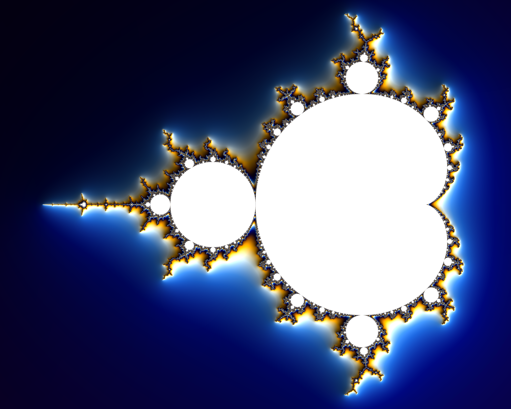

# Mandelbrot CLI

A command-line tool written in Rust to generate Mandelbrot set images. Choose from preset locations or specify custom coordinates.

Interactive web explorer at: https://mandelbrot.mtraverso.net/

## Example Outputs

|               Mandelbrot               |             Minibrot              |          Spirals          |
|:--------------------------------------:|:---------------------------------:|:-------------------------:|
|  |  |  |


## Features
- Generate Mandelbrot set visualizations
- Preset locations or custom coordinates
- Adjustable zoom, down to 10²⁵⁰ using perturbation theory past the limits of 64-bit floats
- Optional image antialiasing
- Configurable resolution, iteration count and shading
- Experimental GPU rendering (wgpu), down to 10³⁰
- Timing information

## Installation
1. Ensure Rust is installed ([rustup.rs](https://rustup.rs/))
2. Clone this repository
3. Build with `cargo build --release`
4. (alternatively) Run directly with `cargo run --release -- <ARGS>`
5. The binary will be located at `target/release/mandelbrot`

## Usage
```
Mandelbrot Set Generator CLI

Usage: mandelbrot [OPTIONS] <COMMAND>

Commands:
  preset  Use a predefined location
  custom  Use custom coordinates
  help    Print this message or the help of the given subcommand(s)

Options:
  -o, --output <OUTPUT>          Output file path [default: output.png]
  -r, --resize                   Also save a half-size, anti-aliased copy next to the output
  -v, --verbose                  Show timing information
      --width <WIDTH>            Image width in pixels [default: 4096]
      --height <HEIGHT>          Image height in pixels [default: 3280]
      --iterations <ITERATIONS>  Maximum iterations per pixel, or "auto" to pick one from the view [default: 1500]
      --shading <SHADING>        Shading mode [default: normal] [possible values: flat, normal]
      --gpu                      Render on the GPU, down to zoom 1e30 (requires the `gpu` feature)
  -h, --help                     Print help
  -V, --version                  Print version
```

### Examples
```bash
# Default preset (mandelbrot)
mandelbrot preset

# Preset with options
mandelbrot preset -l spirals -z 2.0 -o spirals.png -r -v

# Custom coordinates, passing in x, y, and zoom
mandelbrot custom -x -0.75 -y 0.0 -z 1.0 -o custom.png

# Deep zoom: coordinates take any number of decimal places, and "auto" picks the iteration
# limit the view needs
mandelbrot custom -x -1.24949889563508492587065068503213228909045011806661 \
    -y 0.03033300303590165779311010118330780526875599532123 -z 4.7e16 --iterations auto

# Quick, low-resolution preview with flat shading
mandelbrot preset -l quad-spiral --width 800 --height 640 --shading flat
```


## GPU Rendering (experimental)
Building with the `gpu` feature adds a [wgpu](https://wgpu.rs) backend (Vulkan, Metal or DX12):

```bash
cargo run --release --features gpu -- --gpu -v preset -l spirals
```

The CPU computes the high-precision reference orbit, its series approximation table and the
color bands; the GPU iterates every pixel's offset from that orbit in 32-bit floats, skipping
iterations with the table and stopping early on periodic interior points. Long renders run as a
series of short dispatches, so the OS never resets the GPU mid-render. Images match the CPU
renderer apart from pixel noise in chaotic regions. It reaches zoom 10³⁰, where offsets approach
the f32 range.


## Web Viewer
An interactive version runs in the browser at [mandelbrot.mtraverso.net](https://mandelbrot.mtraverso.net).
It uses the same renderer compiled to WebAssembly, split across one Web Worker per CPU core.
Pick a preset, drag a rectangle to zoom into it, click or scroll to zoom, and share the URL to share the view.

```bash
# Needs the wasm32-unknown-unknown target and wasm-bindgen-cli matching Cargo.lock;
# wasm-opt (binaryen) is optional
rustup target add wasm32-unknown-unknown
cargo install wasm-bindgen-cli --version <version from Cargo.lock>
bash web/build.sh

# Serve dist/ with any static file server
python3 -m http.server -d dist 8000
```

Merges to `master` deploy to Cloudflare Workers. Each pull request gets a preview URL posted as a comment.


## Benchmarks
```bash
# Run all scenarios, writing results, summary and images to target/bench
cargo bench --bench render

# Fewer samples, subset of scenarios, compared against a previous run
cargo bench --bench render -- --samples 2 --filter spirals --baseline path/to/previous

# Also time the GPU renderer, in scenarios named gpu/...
cargo bench --features gpu --bench render -- --filter gpu
```

Each run records the machine it ran on. Comparisons against a baseline from different hardware
are marked ❔, and changes only count when they exceed both `--threshold` and the measured noise.

The `Benchmark` workflow builds the bench binary for both the change and its base commit (the PR
base, or the previous commit on `master`) and runs them back to back on the same runner. The job
summary shows timing deltas and image diffs, and the `bench-results` artifact holds the rendered
images. Pushes to `master` publish timing history to the `gh-pages` branch
(charts at `https://<owner>.github.io/mandelbrot/dev/bench/` once GitHub Pages is enabled).


## License
This project is licensed under the MIT License - see the [LICENSE](LICENSE.txt) file for details.
