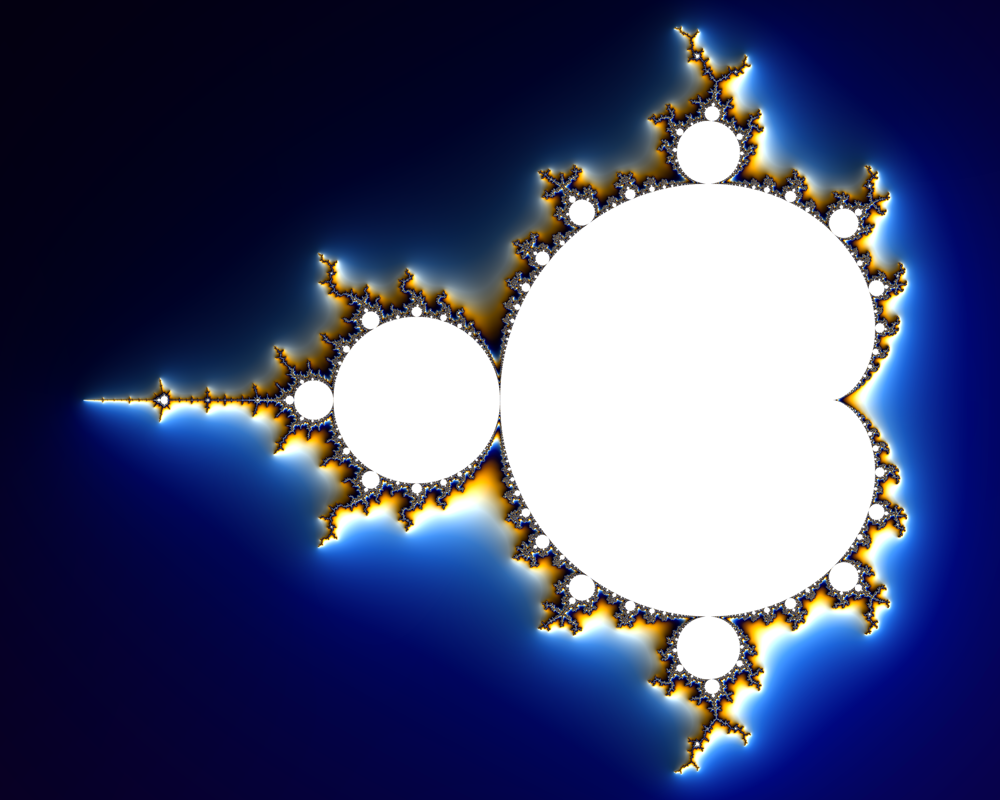

# Mandelbrot CLI

A command-line tool written in Rust to generate Mandelbrot set images. Choose from preset locations or specify custom coordinates.

Interactive web explorer at: https://mandelbrot.mtraverso.net/

## Example Outputs

|               Mandelbrot               |             Minibrot              |          Spirals          |
|:--------------------------------------:|:---------------------------------:|:-------------------------:|
|  |  |  |


## Features
- Preset locations or custom coordinates
- Deep zoom down to 10²⁵⁰, using perturbation theory past the limits of 64-bit floats
- Automatic iteration limits, normal-map or flat shading, and optional antialiasing
- Color palettes: classic, fire, ocean, mono and sunset
- Optional distance-estimated outlines, which turn filaments too thin to resolve into smooth lines
- GPU rendering with [wgpu](https://wgpu.rs), natively and through WebGPU in the browser

## Installation
With [Rust](https://rustup.rs/) installed:

```bash
cargo build --release                  # binary at target/release/mandelbrot
cargo build --release --features gpu   # with the GPU renderer
```

## Usage
```bash
# A preset location
mandelbrot preset -l spirals -o spirals.png

# Custom coordinates and zoom
mandelbrot custom -x -0.75 -y 0.0 -z 1.0

# A deep zoom, letting the view choose its iteration limit
mandelbrot custom -x -1.24949889563508492587065068503213228909045011806661 \
    -y 0.03033300303590165779311010118330780526875599532123 -z 4.7e16 --iterations auto

# In another palette
mandelbrot --palette sunset preset -l spirals

# With filaments too thin to resolve drawn as dark lines instead of noise
mandelbrot --outline dark preset -l spirals

# On the GPU
mandelbrot --gpu preset -l spirals
```

Run `mandelbrot --help` for all options, including image size, shading, palette and timing output.

## How It Works
Deep views are rendered with perturbation theory: one reference orbit is computed at high
precision, and every pixel iterates only its small offset from it in ordinary floats, skipping
ahead with a series approximation. On the GPU the pixels run in parallel, with offsets past the
range of 32-bit floats carried with a separate exponent.

## Web Viewer
[mandelbrot.mtraverso.net](https://mandelbrot.mtraverso.net) runs the same renderer compiled to
WebAssembly, on the GPU through WebGPU or across Web Workers otherwise. It supports zooming by
click, scroll, drag or pinch, an infinite auto zoom, sharing views by URL, and high-resolution PNG
downloads.

To run it locally, see [`web/build.sh`](web/build.sh), then serve `dist/` with any static file
server. Merges to `master` deploy automatically, and each pull request gets a preview URL.

## Benchmarks
```bash
cargo bench --bench render                                 # all scenarios, results in target/bench
cargo bench --features gpu --bench render -- --filter gpu  # the GPU scenarios
```

CI benchmarks every pull request against its base and reports timing changes and image diffs.

## License
MIT - see [LICENSE](LICENSE.txt).
